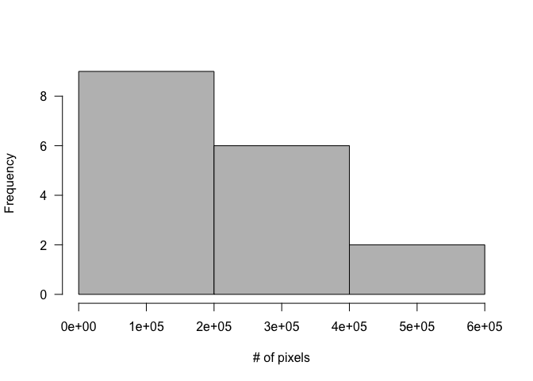
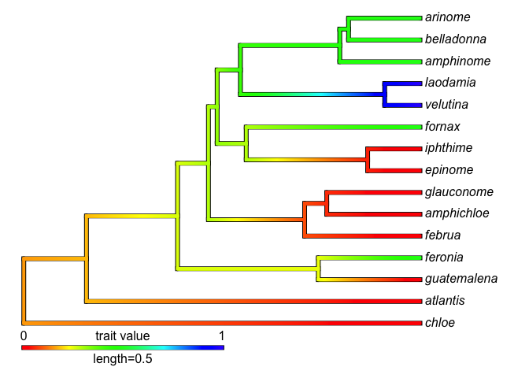
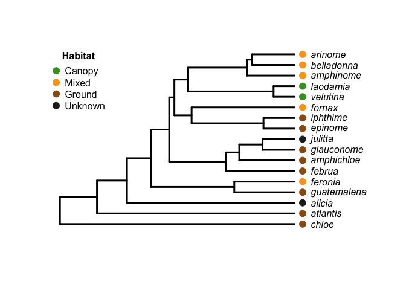

# 
C. A. Hamm  
`r format(Sys.Date())`  


**Wing shape evolution in *Hamadryas* butterflies corresponds to vertical microhabitat use and species range size**

This document is an `RMarkdown` version of the code for the Hamm, Penz and DeVries manuscript:


```r
library("geomorph")
```

```
## Loading required package: rgl
```

```
## Loading required package: ape
```

```r
library("phytools") 
```

```
## Loading required package: maps
```

```r
library("geiger")
library("spaceMovie")
```

# Prepare data 

## Import *Hamadryas* phylogeny


```r
Hama <- read.nexus("../Data/Hamydryas_ml.tre")
plot(Hama)
```


```r
is.ultrametric(Hama)
```

```
## [1] FALSE
```

## Make tree ultrametric


```r
lam <- 10^(-1:6) # lamdba is the smoothing parameter. 
cv <- sapply(lam, function(x) sum(attr(chronopl(Hama, lambda = x, CV = TRUE), "D2")))
plot(lam, cv, pch = 19, ylab = "cross-validation score", 
	xlab = expression(paste(lambda)), las = 1, cex = 1.5) # lowest CV is 0.1
```


```r
Hama2 <- chronopl(phy = Hama, lambda = 0.1, CV = TRUE, eval.max = 1e3, iter.max = 1e4)
is.ultrametric(Hama2) # Tree is now ultrametric
```

## Import *forewing* data


```r
fore <- readland.tps("../Data/Hama_dorsal_3_aligned.tps",	specID = "ID")
str(fore)
dim(fore) # 50 landmarks with X & Y coordinates, for 71 samples

fore_gpa <- gpagen(A = fore, PrinAxes = FALSE, Proj = TRUE, ProcD = TRUE, max.iter = 1e4, print.progress = FALSE) # used Procrustes distance for sliding in TPSrelW
plotOutliers(fore_gpa$coords) # laodamia and velutina are a bit away from everyone else, but they are weird to begin with.
```


```r
fw <- two.d.array(fore_gpa$coords)
dim(fw)
table(rownames(fw))
match(Hama2$tip.label, row.names(fw)) # confirm names in tree and data match
```

## Import *hind wing* data


```r
hind <- readland.tps("../Data/Hama_vent_3.tps", specID = "ID")
str(hind)
dim(hind)

hind_gpa <- gpagen(A = hind, PrinAxes = FALSE, Proj = TRUE, ProcD = TRUE, max.iter = 1e4, print.progress = FALSE) # used Procrustes distance for sliding in TPSrelW

plotOutliers(hind_gpa$coords) # laodamia and velutina ARE weird (found exclusively in the canopy), chloe is the earliest diverging taxon in our phylogeny and has weird looking hind wings
```


```r
hw <- two.d.array(hind_gpa$coords)
dim(hw)
table(rownames(hw))
match(Hama2$tip.label, row.names(hw)) # confirm names in tree and data match

groupH <- as.factor(unique(rownames(hw)))
```

# *Forewing* analysis 

## Visualize data
With the data read in, lets take a look at them

```r
# examine correlations of characters within wings as well
plotAllSpecimens(fore_gpa$coords, mean = TRUE)
```


```r
# str(fore_gpa)

plotTangentSpace(fore_gpa$coords, label = TRUE, warpgrids = TRUE) # PC1 40.8%, PC2 25.7%
```


## Mean shape

```r
# Now calculate mean shape because we can only use one indidivual per species.
groupF <- as.factor(unique(rownames(fw)))

pF <- dim(fore_gpa$coords)[1]
kF <- dim(fore_gpa$coords)[2]
YF <- array(NA, dim = c(pF, kF, length(levels(groupF))))
dimnames(YF)[[3]] <- levels(groupF)
dim(YF)
```

```
## [1] 50  2 17
```

```r
# A function to calculate mean shape
for(i in 1:length(levels(groupF))){
	grpF <- fw[which(groupF == levels(groupF)[i]), ]
	fooF <- arrayspecs(grpF, pF, kF)
	YF[, , i] <- mshape(fooF)
}

#YF # object with mean shape by species
dim(YF)
```

```
## [1] 50  2 17
```

```r
plot(YF[, 1, ], YF[, 2, ], pch = 19)
```


```r
# Convert to 2d array
YF2d <- two.d.array(YF)
#head(YF2d)
dim(YF2d)
```

```
## [1]  17 100
```

```r
# I think that my function worked correctly, but I want to be super duper extra safe, so I'm going to double check. 
velutina_fw <- fw[c(17, 68:70), ] # 4 velutina samples
v1F <- arrayspecs(velutina_fw, p = 50, k = 2)
v2F <- mshape(v1F)

plot(YF[, , "velutina"], pch = 19, las = 1, ylab = "", xlab = "")
points(v2F[, 1], v2F[, 2], pch = 1, col = SW_palette("Inquisitor")[1]) # good, the points match up!
```


```r
# Now a plot of mean shape by species
plotTangentSpace(A = YF, label = TRUE) # PC1 = 37%, PC2 = 28%
```


```
## 
## PC Summary
## 
## Importance of components:
##                            PC1     PC2     PC3      PC4      PC5      PC6
## Standard deviation     0.02173 0.01881 0.01339 0.008349 0.007814 0.007413
## Proportion of Variance 0.36996 0.27715 0.14041 0.054630 0.047850 0.043060
## Cumulative Proportion  0.36996 0.64710 0.78751 0.842140 0.889990 0.933050
##                             PC7      PC8      PC9     PC10     PC11
## Standard deviation     0.004924 0.004093 0.003566 0.003084 0.002737
## Proportion of Variance 0.019000 0.013130 0.009960 0.007460 0.005870
## Cumulative Proportion  0.952050 0.965180 0.975150 0.982600 0.988470
##                            PC12     PC13     PC14     PC15      PC16
## Standard deviation     0.002212 0.001837 0.001768 0.001525 0.0009968
## Proportion of Variance 0.003840 0.002640 0.002450 0.001820 0.0007800
## Cumulative Proportion  0.992310 0.994950 0.997400 0.999220 1.0000000
##                             PC17
## Standard deviation     5.066e-17
## Proportion of Variance 0.000e+00
## Cumulative Proportion  1.000e+00
```

## Phylomorphospace

```r
plotGMPhyloMorphoSpace(phy = Hama2, A = YF, ancStates = FALSE) 
```


Here we set up the forewing data into three partitions:

1. leading edge
1. outer margin
1. trailing edge

## Sanity check

```r
# Now confirm the set of landmarks that correspond to leading, outer, and trailing edge of the wing. The circles should perfectly overlap if I am properly delimiting the data.
plot(YF[, 1, ], YF[, 2, ], pch = 19)
points(YF[1:6, 1, ], YF[1:6, 2, ], col = SW_palette("Zeb")[3], pch = 1) # outer margin of wing
points(YF[7:33, 1, ], YF[7:33, 2, ], pch = 1, col = SW_palette("Zeb")[4]) # leading edge
points(YF[34:50, 1, ], YF[34:50, 2, ], pch = 1, col = SW_palette("Zeb")[1]) # trailing edge points
```


## Centroid size

```r
## Import forewing centroid size data
fore_cs <- read.delim("../Data/Hama_dorsal_3_centroid.txt", sep = "\t", header = TRUE)
head(fore_cs)
```

```
##      species    csize
## 1     alicia 480.0649
## 2 amphichloe 428.1546
## 3  amphinome 454.8240
## 4    arinome 558.5335
## 5   atlantis 457.2616
## 6 belladonna 483.0818
```

```r
str(fore_cs)
```

```
## 'data.frame':	73 obs. of  2 variables:
##  $ species: Factor w/ 18 levels "alicia","amphichloe",..: 1 2 3 5 6 7 8 9 10 11 ...
##  $ csize  : num  480 428 455 559 457 ...
```

```r
#fore_cs
table(fore_cs$species)
```

```
## 
##      alicia  amphichloe   amphinome       arete     arinome    atlantis 
##           1           1           5           3           5           4 
##  belladonna       chloe     epinome      februa     feronia      fornax 
##           4           6           3           5           6           5 
##  glauconome guatemalena    iphthime     julitta    laodamia    velutina 
##           6           6           3           1           5           4
```

```r
## calculate mean centrois size by species
fw_cs <- with(fore_cs, tapply(csize, species, mean))
fw_cs <- fw_cs[-4] #remove arete, which is not in the tree
fw_cs <- fw_cs[Hama2$tip.label] #make sure the labels are in the same order as the tree
fw_cs 
```

```
##       chloe    atlantis      alicia guatemalena     feronia      februa 
##    435.7279    540.1311    480.0649    668.6291    592.9765    593.5246 
##  amphichloe  glauconome     julitta     epinome    iphthime      fornax 
##    428.1546    579.6337    448.8233    513.3284    543.7346    603.0057 
##    velutina    laodamia   amphinome  belladonna     arinome 
##    358.0246    544.9568    579.1293    343.2050    595.9316
```

# *Hind wing* analyses 

## Visualize data

```r
plotAllSpecimens(hind_gpa$coords, mean = TRUE)
```


```r
plotTangentSpace(hind_gpa$coords, label = TRUE, warpgrids = TRUE)
```


```
## 
## PC Summary
## 
## Importance of components:
##                           PC1     PC2     PC3     PC4     PC5     PC6
## Standard deviation     0.0383 0.01753 0.01443 0.01280 0.01077 0.00814
## Proportion of Variance 0.5745 0.12037 0.08157 0.06417 0.04541 0.02595
## Cumulative Proportion  0.5745 0.69486 0.77643 0.84060 0.88601 0.91196
##                             PC7      PC8      PC9     PC10     PC11
## Standard deviation     0.007198 0.006031 0.005179 0.004789 0.004553
## Proportion of Variance 0.020290 0.014250 0.010510 0.008980 0.008120
## Cumulative Proportion  0.932250 0.946500 0.957010 0.965990 0.974110
##                            PC12     PC13    PC14     PC15     PC16
## Standard deviation     0.003781 0.003454 0.00316 0.002797 0.002576
## Proportion of Variance 0.005600 0.004670 0.00391 0.003060 0.002600
## Cumulative Proportion  0.979710 0.984380 0.98830 0.991360 0.993960
##                            PC17     PC18     PC19     PC20     PC21
## Standard deviation     0.002207 0.001988 0.001932 0.001694 2.27e-16
## Proportion of Variance 0.001910 0.001550 0.001460 0.001120 0.00e+00
## Cumulative Proportion  0.995870 0.997410 0.998880 1.000000 1.00e+00
##                             PC22      PC23     PC24
## Standard deviation     1.353e-16 9.506e-17 3.19e-17
## Proportion of Variance 0.000e+00 0.000e+00 0.00e+00
## Cumulative Proportion  1.000e+00 1.000e+00 1.00e+00
```

## Mean shape

```r
pH <- dim(hind_gpa$coords)[1]
kH <- dim(hind_gpa$coords)[2]
YH <- array(NA, dim = c(pH, kH, length(levels(groupH))))
dimnames(YH)[[3]] <- levels(groupH)
dim(YH)
```

```
## [1] 12  2 17
```

```r
for(i in 1:length(levels(groupH))){
	grpH <- hw[which(groupH == levels(groupH)[i]), ]
	fooH <- arrayspecs(grpH, pH, kH)
	YH[, , i] <- mshape(fooH)
}
#YH
dim(YH)
```

```
## [1] 12  2 17
```

```r
plot(YH[, 1, ], YH[, 2, ], pch = 19)
```


```r
YH2d <- two.d.array(YH)
#head(YH2d)
dim(YH2d)
```

```
## [1] 17 24
```

```r
# Let's make sure that the above function calulated a mean that looks like the mean calculated for one species by `geomorph`.
velutina_hw <- hw[c(17, 69:71), ] # The 4 velutina samples
v1H <- arrayspecs(velutina_hw, p = 12, k = 2)
v2H <- mshape(v1H)

plot(YH[, , "velutina"], pch = 19, las = 1, ylab = "", xlab = "")
points(v2H[, 1], v2H[, 2], pch = 1, add = TRUE, col = SW_palette("Inquisitor")[1]) # Points match up
```


## Phylomorphospace

```r
plotGMPhyloMorphoSpace(phy = Hama2, A = YH, ancStates = FALSE) 
```


## Sanity check

```r
# Now confirm the set of landmarks that correspond to the structural and outer margins of the wings. The circles should perfectly overlap if I am properly delimiting the data. 
plot(YH[, 1, ], YH[, 2, ], pch = 19, ylab = "", xlab = "", las = 1)
points(YH[1:6, 1, ], YH[1:6, 2, ], col = SW_palette("Chopper")[1], pch = 1, add = TRUE) # structural landmarks
points(YH[7:12, 1, ], YH[7:12, 2, ], ylab = "", xlab = "", col = SW_palette("AT_DP")[3], pch = 1, add = TRUE) # wing maring landmarks
```


## Centroid size

```r
#hind_gpa$Csize
hind_cs <- as.data.frame(names(hind_gpa$Csize))

hind_cs$Csize <- (hind_gpa$Csize)
hind_cs <- reshape::rename(hind_cs, c("names(hind_gpa$Csize)" = "species"))
#hind_cs
table(hind_cs$species)
```

```
## 
##      alicia  amphichloe   amphinome     arinome    atlantis  belladonna 
##           1           1           5           5           4           4 
##       chloe     epinome      februa     feronia      fornax  glauconome 
##           6           3           5           6           5           6 
## guatemalena    iphthime     julitta    laodamia    velutina 
##           6           3           2           5           4
```

```r
hw_cs <- with(hind_cs, tapply(Csize, species, mean))
hw_cs
```

```
##      alicia  amphichloe   amphinome     arinome    atlantis  belladonna 
##   1312.1768   1349.0319   1522.8273   1608.5889   1683.2328    974.8383 
##       chloe     epinome      februa     feronia      fornax  glauconome 
##   1314.4831   1370.8771   1564.9458   1640.1901   1523.4352   1737.9695 
## guatemalena    iphthime     julitta    laodamia    velutina 
##   1906.6096   1409.4983   1195.1094   1411.0927    942.4769
```

```r
hw_cs <- hw_cs[Hama2$tip.label] #make sure the labels are in the same order as the tree
hw_cs 
```

```
##       chloe    atlantis      alicia guatemalena     feronia      februa 
##   1314.4831   1683.2328   1312.1768   1906.6096   1640.1901   1564.9458 
##  amphichloe  glauconome     julitta     epinome    iphthime      fornax 
##   1349.0319   1737.9695   1195.1094   1370.8771   1409.4983   1523.4352 
##    velutina    laodamia   amphinome  belladonna     arinome 
##    942.4769   1411.0927   1522.8273    974.8383   1608.5889
```

# Comparative analyses 

## Covariate data

```r
# import range data
ranges <- read.csv("../Data/Hamadryas_range.csv", header = TRUE, row.names = 1)
ranges$Range <- as.factor(ranges$Range)
str(ranges)
```

```
## 'data.frame':	17 obs. of  2 variables:
##  $ Range : Factor w/ 3 levels "Large","Medium",..: 2 3 1 2 2 2 2 2 3 2 ...
##  $ Pixels: int  221339 20488 433009 372010 140293 132323 322290 327096 1979 50364 ...
```

```r
hist(ranges$Pixels, col = "grey", breaks = "Scott", las = 1, main = "", xlab = "# of pixels") # three breaks with the Scott method: Small <= 200000; 200001 < Medium >= 400000; 400001 >= Large 
```



```r
H.range <- matrix(ranges$Range, dimnames = list(row.names(ranges)))
H.range <- as.factor(H.range)
names(H.range) <- row.names(ranges)
H.range <- H.range[Hama2$tip.label]
H.range
```

```
##       chloe    atlantis      alicia guatemalena     feronia      februa 
##      Medium       Small       Small      Medium      Medium       Large 
##  amphichloe  glauconome     julitta     epinome    iphthime      fornax 
##      Medium      Medium       Small      Medium      Medium      Medium 
##    velutina    laodamia   amphinome  belladonna     arinome 
##      Medium      Medium       Large       Small      Medium 
## Levels: Large Medium Small
```

```r
# Import habitat data
cu <- c(NA, 0, 0.5, 0.5, 0, 0.5, 0, 0, 0, 0.5, 0.5, 0, 0, 0 , NA, 1, 1) #0 = understory, 0.5 = mixed, 1 = canopy
cu <- matrix(cu, dimnames = list(rownames(YF2d)))
cu <-cu[Hama2$tip.label, ]
cu1 <- cu[-c(3, 9)]
cu1
```

```
##       chloe    atlantis guatemalena     feronia      februa  amphichloe 
##         0.0         0.0         0.0         0.5         0.0         0.0 
##  glauconome     epinome    iphthime      fornax    velutina    laodamia 
##         0.0         0.0         0.0         0.5         1.0         1.0 
##   amphinome  belladonna     arinome 
##         0.5         0.5         0.5
```

```r
# Prune the tree
Hama.pruned <- treedata(phy = Hama2, data = cu1, sort = TRUE, warnings = TRUE) # Safety check to ensure that the covariate data and tree tips match up
plot(Hama.pruned$phy)
```


## Comparative methods

```r
## Phylogenetic signal for forewing shape
FW_sig <- physignal(phy = Hama2, A = YF, iter = 1e4, seed = 876234872, print.progress = FALSE) # K = 0.716, P << 0.001, FW shape is associated with phylogeny

# phylogenetic signal for forewing centroid size
fw_cs_sig <- physignal(phy = Hama2, A = as.matrix(fw_cs), iter = 1e4, seed = 731427, print.progress = FALSE) # K = 0.30, P = 0.856, centroid size no significant phylogenetic signal

# Phylogenetic signal for hind wing shape
hw_sig <- physignal(phy = Hama2, A = YH, iter = 1e4, seed = 826342, print.progress = FALSE) # K = 0.8, P = 0.0018, significant signal for HW shape

# phylogenetic signal for hid wing centroid size
hw_cs_sig <- physignal(phy = Hama2, A = as.matrix(hw_cs), iter = 1e4, seed = 6445, print.progress = FALSE) # K = 0.314, P = 0.81, no significant signal for HW centroid size
```

## Ancestral state reconstruction

```r
# ancestral state reconstruction
anc.ML(tree = Hama.pruned$phy, x = cu1, maxit = 1e4, model = "BM")
```

```
## Ancestral character estimates using anc.ML under a BM model:
##       16       17       18       19       20       21       22       23 
## 0.157929 0.182911 0.269192 0.255092 0.301547 0.093282 0.063238 0.329450 
##       24       25       26       27       28       29 
## 0.302794 0.053659 0.425571 0.937406 0.483355 0.486643 
## 
## Fitted model parameters & likelihood:
##      sig2 log-likelihood
##  0.079388       20.54062
## 
## R thinks it has found the ML solution.
```

```r
fastAnc(tree = Hama.pruned$phy, x = cu1, vars = TRUE, CI = TRUE)# pretty much same estimates for both ASR methods
```

```
## Ancestral character estimates using fastAnc:
##       16       17       18       19       20       21       22       23 
## 0.157929 0.182911 0.269192 0.255092 0.301547 0.093282 0.063238 0.329450 
##       24       25       26       27       28       29 
## 0.302794 0.053659 0.425571 0.937406 0.483355 0.486643 
## 
## Variances on ancestral states:
##       16       17       18       19       20       21       22       23 
## 0.046303 0.033021 0.017788 0.016218 0.012965 0.013163 0.012065 0.012419 
##       24       25       26       27       28       29 
## 0.015213 0.009102 0.014104 0.006468 0.009610 0.009015 
## 
## Lower & upper 95% CIs:
##        lower    upper
## 16 -0.263826 0.579684
## 17 -0.173256 0.539078
## 18  0.007780 0.530604
## 19  0.005484 0.504700
## 20  0.078376 0.524719
## 21 -0.131588 0.318151
## 22 -0.152048 0.278524
## 23  0.111024 0.547876
## 24  0.061044 0.544544
## 25 -0.133336 0.240653
## 26  0.192802 0.658340
## 27  0.779781 1.095032
## 28  0.291219 0.675491
## 29  0.300549 0.672738
```

```r
contMap(Hama.pruned$phy, x = cu1, res = 1000)
```



```r
contMap(Hama.pruned$phy, x = cu1, res = 1000, type = "fan", legend = FALSE)
```


## Phylogenetic integration

```r
# leading and trailing edge of FW
LE_TE_pls <- phylo.integration(A = YF[7:33, , ], A2 = YF[34:50, , ], phy = Hama2, iter = 1e4, seed = 98234, print.progress = FALSE) # r-PLS = 0.867, P = 0.001

# internal and terminal (vein) of HW
HW_pls <- phylo.integration(A = YH[1:6, , ], A2 = YH[7:12, , ],	phy = Hama2, iter = 1e4, seed = 876234, print.progress = FALSE) # r-pls = 0.93, P = <<0.001

#accounting for phylogeny, are FW and HW "integrated"?
FW_HW <- phylo.integration(A = YF, A2 = YH, phy = Hama2, iter = 1e4, seed = 987324, print.progress = FALSE) # r-pls = 0.85, P = 0.0028
```

## Phylogenetic independent constrast

```r
#fore- and hind wing csize covariation? 
#standard phylogenetic regression
plot(x = hw_cs, y = fw_cs, pch = 19, las = 1, ylab = "Forewing centroid size", xlab = "Hind wing centroid size")
```


```r
fw_pic <- pic(fw_cs, phy = Hama2, scaled = TRUE)
hw_pic <- pic(hw_cs, phy = Hama2, scaled = TRUE)
m1 <- lm(fw_pic ~ hw_pic)
summary(m1)
```

```
## 
## Call:
## lm(formula = fw_pic ~ hw_pic)
## 
## Residuals:
##     Min      1Q  Median      3Q     Max 
## -95.855 -27.556  -6.307  23.840 117.052 
## 
## Coefficients:
##             Estimate Std. Error t value Pr(>|t|)    
## (Intercept) -22.9301    13.2733  -1.728    0.106    
## hw_pic        0.3551     0.0256  13.875 1.42e-09 ***
## ---
## Signif. codes:  0 '***' 0.001 '**' 0.01 '*' 0.05 '.' 0.1 ' ' 1
## 
## Residual standard error: 53.09 on 14 degrees of freedom
## Multiple R-squared:  0.9322,	Adjusted R-squared:  0.9274 
## F-statistic: 192.5 on 1 and 14 DF,  p-value: 1.422e-09
```

```r
plot(x = hw_pic, y = fw_pic, pch = 19, las = 1, ylab = "Forewing centroid size", xlab = "Hind wing centroid size")
abline(m1, lwd = 3, lty = 3)
```


```r
#phylogenetic regression through the origin
lm01 <- lmorigin(fw_pic ~ hw_pic, nperm = 1e4)
```

```
## Regression through the origin 
## Permutation method = raw data 
## Computation time = 11.846000  sec
```

```r
lm01
```

```
## 
## Regression through the origin 
## 
## Call:
## lmorigin(formula = fw_pic ~ hw_pic, nperm = 10000) 
## 
## Coefficients and parametric test results 
##  
##        Coefficient Std_error t-value Pr(>|t|)    
## hw_pic    0.355474  0.027236  13.052 1.36e-09 ***
## ---
## Signif. codes:  0 '***' 0.001 '**' 0.01 '*' 0.05 '.' 0.1 ' ' 1
## 
## Two-tailed tests of regression coefficients
##  
##        Coefficient p-param    p-perm    
## hw_pic     0.35547       0 9.999e-05 ***
## ---
## Signif. codes:  0 '***' 0.001 '**' 0.01 '*' 0.05 '.' 0.1 ' ' 1
## 
## One-tailed tests of regression coefficients: 
## test in the direction of the sign of the coefficient
##  
##        Coefficient p-param    p-perm    
## hw_pic     0.35547       0 9.999e-05 ***
## ---
## Signif. codes:  0 '***' 0.001 '**' 0.01 '*' 0.05 '.' 0.1 ' ' 1
## 
## Residual standard error: 56.49448 on 15 degrees of freedom 
## Multiple R-square: 0.9190721   Adjusted R-square: 0.9136769 
## 
## F-statistic: 170.3502 on 1 and 15 DF:
##    parametric p-value   : 1.359877e-09 
##    permutational p-value: 9.999e-05 
## after 10000 permutations of raw data 
## 
```

## Rates of morphological change


```r
# forewing, change rate based on habitat
fw_habitat_rate <- compare.evol.rates(phy = Hama2, A = YF, gp = cu1, iter = 1e4, print.progress = FALSE) 
fw_habitat_rate # no association with habitat
```

```
## 
## Call:
## 
## 
## Observed Rate Ratio: 2.15842
## 
## P-value: 0.15758
## 
## Based on 10001 random permutations
## 
## The rate for group 0 is 2.30797422796976e-05  
## 
## The rate for group 0.5 is 2.00678536979179e-05  
## 
## The rate for group 1 is 4.33147852029787e-05
```

```r
fw_habitat_rate$pairwise.pvalue
```

```
##             0       0.5
## 0.5 0.6814319          
## 1   0.1815818 0.1623838
```

```r
#forewing, change based on centroid size
fwcs_habitat_rate <- compare.evol.rates(phy = Hama2, A = as.matrix(fw_cs), gp = cu1, iter = 1e4, print.progress = FALSE)
fwcs_habitat_rate # no association with centroid size
```

```
## 
## Call:
## 
## 
## Observed Rate Ratio: 6.62976
## 
## P-value: 0.38666
## 
## Based on 10001 random permutations
## 
## The rate for group 0 is 15544.3608917977  
## 
## The rate for group 0.5 is 45918.2066221997  
## 
## The rate for group 1 is 103055.392645855
```

```r
# forewing, rate based on range size
fw_range_rate <- compare.evol.rates(phy = Hama2, A = YF, gp = H.range, iter = 1e4, print.progress = FALSE) 
fw_range_rate # no sig difference in FW rates based on habitat size
```

```
## 
## Call:
## 
## 
## Observed Rate Ratio: 1.16341
## 
## P-value: 0.83802
## 
## Based on 10001 random permutations
## 
## The rate for group Large is 2.2279235829634e-05  
## 
## The rate for group Medium is 2.59199645178201e-05  
## 
## The rate for group Small is 2.24177599349889e-05
```

```r
# forewing centroid size and range size
fwcs_range_rate <- compare.evol.rates(phy = Hama2, A = as.matrix(fw_cs), gp = H.range, iter = 1e4, print.progress = FALSE)
fwcs_range_rate # no association
```

```
## 
## Call:
## 
## 
## Observed Rate Ratio: 2.15629
## 
## P-value: 0.81952
## 
## Based on 10001 random permutations
## 
## The rate for group Large is 20980.53791141  
## 
## The rate for group Medium is 33513.3052993149  
## 
## The rate for group Small is 45240.1681061333
```

## *Hind wing* change

```r
# rate of HW change based on habitat
Hw_habitat_rate <- compare.evol.rates(phy = Hama2, A = YH, gp = cu1, iter = 1e4, print.progress = FALSE)
Hw_habitat_rate # Yup. HW has different rates based on habitat
```

```
## 
## Call:
## 
## 
## Observed Rate Ratio: 13.44925
## 
## P-value: 2e-04
## 
## Based on 10001 random permutations
## 
## The rate for group 0 is 0.000123116103985654  
## 
## The rate for group 0.5 is 8.57354209436418e-05  
## 
## The rate for group 1 is 0.00115307694098135
```

```r
Hw_habitat_rate$pairwise.pvalue # can't distinguish 0-0.5, can distinguish canopy from both understory and mixed. That is cool, considering FW and HW are integrated, but HW rates faster in canopy. 
```

```
##              0        0.5
## 0.5 0.43265673           
## 1   0.00029997 0.00009999
```

```r
# hind wing centroid size based on habitat
Hwcs_habitat_rate <- compare.evol.rates(phy = Hama2, A = as.matrix(hw_cs), gp = cu1, iter = 1e4, print.progress = FALSE)
Hwcs_habitat_rate # No sig association
```

```
## 
## Call:
## 
## 
## Observed Rate Ratio: 5.05306
## 
## P-value: 0.45765
## 
## Based on 10001 random permutations
## 
## The rate for group 0 is 136197.791136908  
## 
## The rate for group 0.5 is 261861.024931504  
## 
## The rate for group 1 is 688216.050953653
```

```r
# rate of HW change based on range
Hw_range_rate <- compare.evol.rates(phy = Hama2, A = YH, gp = H.range, iter = 1e4, print.progress = FALSE) 
Hw_range_rate # HW rate is sig fast
```

```
## 
## Call:
## 
## 
## Observed Rate Ratio: 4.03484
## 
## P-value: 0.0312
## 
## Based on 10001 random permutations
## 
## The rate for group Large is 7.63738547409181e-05  
## 
## The rate for group Medium is 0.000308156075594816  
## 
## The rate for group Small is 0.000113047961695258
```

```r
Hw_range_rate$pairwise.pvalue
```

```
##             Large     Medium
## Medium 0.00739926           
## Small  0.49945005 0.01349865
```

```r
Hwcs_range_rate <- compare.evol.rates(phy = Hama2, A = as.matrix(hw_cs), gp = H.range, iter = 1e4, print.progress = FALSE) # large and medium ranges are faster than small, large MUCH faster
```

##  Habitat plot

```r
nspecies <- length(Hama2$tip.label)
cu_color <- cu
cu_color[cu == 0.0] <- SW_palette("TFA")[7]
cu_color[cu == 0.5] <- SW_palette("TPM")[8]
cu_color[cu == 1.0] <- SW_palette("ROTJ")[5]
cu_color[is.na(cu)] <- SW_palette("Inquisitor")[3]

plot.phylo(Hama2, font = 3, label.offset = 0.07, edge.width = 3)
points(x = rep(1.035, nspecies), y = 1:nspecies, pch = 19, col = cu_color, cex = 1.5)
legend("topleft", legend = c("Canopy", "Mixed", "Ground", "Unknown"), pch = 19, col = c(SW_palette("ROTJ")[5], SW_palette("TPM")[8], SW_palette("TFA")[7], SW_palette("Inquisitor")[3]), pt.cex = 1.5, bty = "n", title = expression(bold("Habitat")))
```


